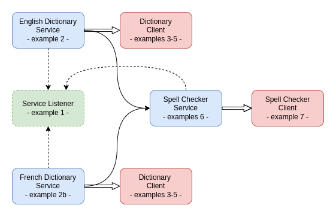
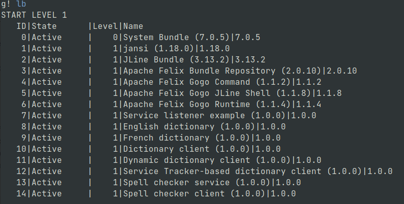

= Apache Felix OSGi - Usage Example
:reproducible:
:doctype: article
:author: Herman Ciechanowiec
:email: herman@ciechanowiec.eu
:chapter-signifier:
:sectnumlevels: 5
:sectanchors:
:toc: left
:toclevels: 5
:icons: font

== Overview
The purpose of this repository is to illustrate main features and functionality offered by the OSGi framework and its Apache Felix implementation. The repository contains codebase developed according to the Apache Felix OSGi Tutorial published at https://felix.apache.org/documentation/tutorials-examples-and-presentations/apache-felix-osgi-tutorial.html.

The repository contains eight examples which constitute a single simple dictionary application. The ordinal numeration of the examples spans from 1 to 7 and includes example #2 and example #2b. Each example represents a separate part (OSGi bundle) of the application.

In the aforementioned tutorial there are also examples #8 and #9. However, those examples aren't supposed to be compiled, built or used. To be consistent with the tutorial, the repository also contains references to the examples #8 and #9, but they can be omitted.

== Architecture
The architecture of the application comprised of the examples is the following:

[cols="20%, 80%", grid=none, frame=none]
|===
>|_Example 1:_ | Service listener example. A bundle that displays messages at startup and when service events occur
>|_Example 2:_ | English dictionary. A bundle that registers an English dictionary service
>|_Example 2b:_ | French dictionary. A bundle that registers a French dictionary service
>|_Example 3:_ | Dictionary client. A bundle that uses the dictionary service if it finds it at startup
>|_Example 4:_ | Dynamic dictionary client. A bundle that uses the dictionary service whenever it becomes available
>|_Example 5:_ | Service Tracker-based dictionary client. A dictionary client using the Service Tracker
>|_Example 6:_ | Spell checker service. A bundle that implements a simple spell checker service
>|_Example 7:_ | Spell checker client. A bundle that uses the spell checker service
|===

List of bundles from the Apache Felix console:

== Compile and Build
[upperalpha]
. The commands pertaining to the compilation and building should be run from the root level of the project, in a sequential manner, starting from the first example.
. The full content of the script which compiles and builds relevant examples is given below. The script with that content named `compile_and_build.sh` is located in the root directory of the repository:
+
[source, bash]
----
#!/bin/bash

# Example 1
javac -cp felix.jar -d ./classes/example1 ./classes/example1/*.java
jar cfm jars/example1.jar manifests/example1/manifest.mf -C classes/example1/ tutorial/example1/

# Example 2
javac -cp felix.jar -d ./classes/example2 ./classes/example2/*.java
jar cfm jars/example2.jar manifests/example2/manifest.mf -C classes/example2/ tutorial/example2/

# Example 2b
javac -cp felix.jar:jars/example2.jar -d ./classes/example2b ./classes/example2b/*.java
jar cfm jars/example2b.jar manifests/example2b/manifest.mf -C classes/example2b/ tutorial/example2b/

# Example 3
javac -cp felix.jar:jars/example2.jar -d ./classes/example3 ./classes/example3/*.java
jar cfm jars/example3.jar manifests/example3/manifest.mf -C classes/example3/ tutorial/example3/

# Example 4
javac -cp felix.jar:jars/example2.jar -d ./classes/example4 ./classes/example4/*.java
jar cfm jars/example4.jar manifests/example4/manifest.mf -C classes/example4/ tutorial/example4/

# Example 5
javac -cp felix.jar:jars/example2.jar -d ./classes/example5 ./classes/example5/*.java
jar cfm jars/example5.jar manifests/example5/manifest.mf -C classes/example5/ tutorial/example5/

# Example 6
javac -cp felix.jar:jars/example2.jar -d ./classes/example6 ./classes/example6/*.java
jar cfm jars/example6.jar manifests/example6/manifest.mf -C classes/example6/ tutorial/example6/

# Example 7
javac -cp felix.jar:jars/example6.jar -d ./classes/example7 ./classes/example7/*.java
jar cfm jars/example7.jar manifests/example7/manifest.mf -C classes/example7/ tutorial/example7/
----

== Deploy
[upperalpha]
. After compilation and building, the _.jar_ files (OSGi bundles) with the examples should be deployed to the Apache Felix instance.
. The commands pertaining to the deployment should be run from the root level of the project, in a sequential manner, starting from the first example.
. It is assumed, that the full path to the repository is `/home/herman_ciechanowiec/0_prog/osgi_first_steps`. If that is not the case, the commands pertaining to the deployment should be changed respectively.

=== Start Apache Felix Instance
Firstly, start the Apache Felix instance. This will fire up an Apache Felix console. The command starting the instance should be run in a separate terminal window, which will be used for deployment commands:

    cd felix_instance && java -jar bin/felix.jar

=== Install Bundles
Secondly, deploy _.jar_ files (OSGi bundles) with the examples by running the following commands inside the Apache Felix console:

----
start file:/home/herman_ciechanowiec/0_prog/osgi_first_steps/jars/example1.jar

start file:/home/herman_ciechanowiec/0_prog/osgi_first_steps/jars/example2.jar

start file:/home/herman_ciechanowiec/0_prog/osgi_first_steps/jars/example2b.jar

start file:/home/herman_ciechanowiec/0_prog/osgi_first_steps/jars/example3.jar

start file:/home/herman_ciechanowiec/0_prog/osgi_first_steps/jars/example4.jar

start file:/home/herman_ciechanowiec/0_prog/osgi_first_steps/jars/example5.jar

start file:/home/herman_ciechanowiec/0_prog/osgi_first_steps/jars/example6.jar

start file:/home/herman_ciechanowiec/0_prog/osgi_first_steps/jars/example7.jar
----
